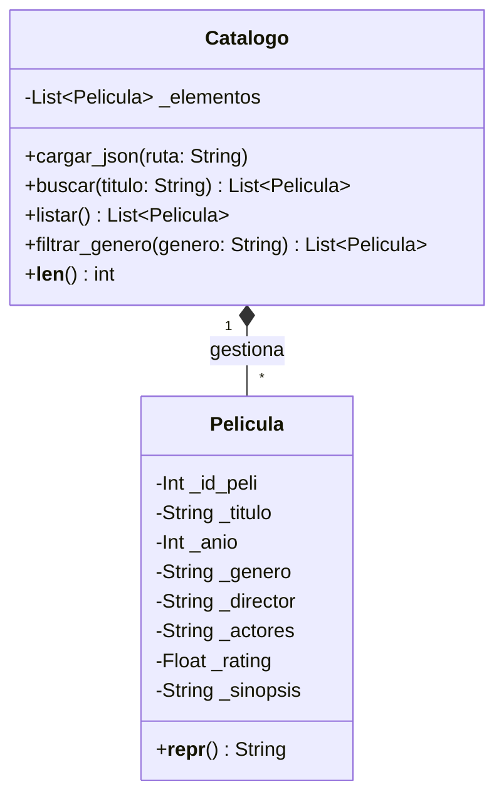

```mermaid
classDiagram
    class Pelicula {
        -Int _id_peli
        -String _titulo
        -Int _anio
        -String _genero
        -String _director
        -String _actores
        -Float _rating
        -String _sinopsis
        +__repr__() String
    }

    class Catalogo {
        -List~Pelicula~ _elementos
        +cargar_json(ruta: String)
        +buscar(titulo: String) List~Pelicula~
        +listar() List~Pelicula~
        +filtrar_genero(genero: String) List~Pelicula~
        +__len__() int
    }

    Catalogo "1" *-- "*" Pelicula : gestiona
```
