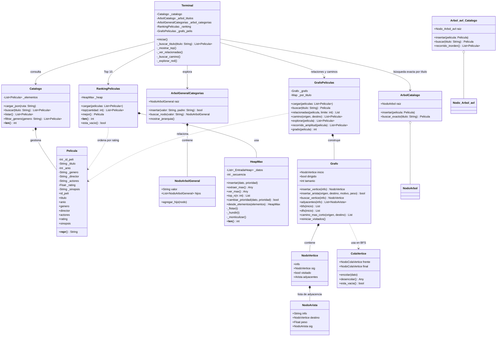

```mermaid
classDiagram
    class Pelicula {
        -Int _id_peli
        -String _titulo
        -Int _anio
        -String _genero
        -String _director
        -String _actores
        -Float _rating
        -String _sinopsis
        +id_peli
        +titulo
        +anio
        +genero
        +director
        +actores
        +rating
        +sinopsis
        +__repr__() String
    }

    class Catalogo {
        -List~Pelicula~ _elementos
        +cargar_json(ruta: String)
        +buscar(titulo: String) List~Pelicula~
        +listar() List~Pelicula~
        +filtrar_genero(genero: String) List~Pelicula~
        +__len__() int
    }

    class ArbolCatalogo {
        +NodoArbol raiz
        +insertar(pelicula: Pelicula)
        +buscar_exacto(titulo: String) Pelicula
    }

    class Arbol_avl_Catalogo {
        +Nodo_Arbol_avl raiz
        +insertar(pelicula: Pelicula)
        +buscar(titulo: String) Pelicula
        +recorrido_inorden() List~Pelicula~
    }

    class ArbolGeneralCategorias {
        +NodoArbolGeneral raiz
        +insertar(valor: String, padre: String) bool
        +buscar_nodo(valor: String) NodoArbolGeneral
        +mostrar_jerarquia()
    }

    class NodoArbolGeneral {
        +String valor
        +List~NodoArbolGeneral~ hijos
        +agregar_hijo(nodo)
    }

    class HeapMax {
        -List~_EntradaHeap~ _datos
        -int _secuencia
        +insertar(dato, prioridad)
        +extraer_max() Any
        +ver_max() Any
        +top_n(n: int) List
        +cambiar_prioridad(dato, prioridad) bool
        +desde_elementos(elementos) HeapMax
        -_flotar(i)
        -_hundir(i)
        -_monticulizar()
        +__len__() int
    }

    class RankingPeliculas {
        -HeapMax _heap
        +cargar(peliculas: List~Pelicula~)
        +top(cantidad: int) List~Pelicula~
        +mejor() Pelicula
        +__len__() int
        +esta_vacio() bool
    }

    class Grafo {
        +NodoVertice inicio
        +bool dirigido
        +int tamanio
        +insertar_vertice(info) NodoVertice
        +insertar_arista(origen, destino, motivo, peso) bool
        +buscar_vertice(info) NodoVertice
        +adyacentes(info) List~NodoArista~
        +bfs(inicio) List
        +dfs(inicio) List
        +camino_mas_corto(origen, destino) List
        +reiniciar_visitados()
    }

    class NodoVertice {
        +info
        +NodoVertice sig
        +bool visitado
        +Arista adyacentes
    }

    class NodoArista {
        +String info
        +NodoVertice destino
        +Float peso
        +NodoArista sig
    }

    class ColaVertice {
        +NodoColaVertice frente
        +NodoColaVertice final
        +encolar(dato)
        +desencolar() Any
        +esta_vacia() bool
    }

    class GrafoPeliculas {
        -Grafo _grafo
        -Map _por_titulo
        +cargar(peliculas: List~Pelicula~)
        +buscar(titulo: String) Pelicula
        +relacionadas(pelicula, limite: int) List
        +camino(origen, destino) List~Pelicula~
        +explorar(pelicula) List~Pelicula~
        +recorrido_amplitud(pelicula) List~Pelicula~
        +grado(pelicula) int
    }

    class Terminal {
        -Catalogo _catalogo
        -ArbolCatalogo _arbol_titulos
        -ArbolGeneralCategorias _arbol_categorias
        -RankingPeliculas _ranking
        -GrafoPeliculas _grafo_pelis
        +iniciar()
        -_buscar_titulo(titulo: String) List~Pelicula~
        -_mostrar_top()
        -_ver_relacionadas()
        -_buscar_camino()
        -_explorar_red()
    }

    Catalogo "1" *-- "*" Pelicula : gestiona
    ArbolCatalogo o-- NodoArbol
    Arbol_avl_Catalogo o-- Nodo_Arbol_avl
    ArbolGeneralCategorias *-- NodoArbolGeneral : contiene
    RankingPeliculas *-- HeapMax : usa
    RankingPeliculas ..> Pelicula : ordena por rating
    Grafo *-- NodoVertice : contiene
    NodoVertice *-- NodoArista : lista de adyacencia
    Grafo ..> ColaVertice : usa en BFS
    GrafoPeliculas *-- Grafo : construye
    GrafoPeliculas ..> Pelicula : relaciona
    Terminal --> Catalogo : consulta
    Terminal --> ArbolCatalogo : búsqueda exacta por título
    Terminal --> ArbolGeneralCategorias : explora
    Terminal --> RankingPeliculas : Top 10
    Terminal --> GrafoPeliculas : relaciones y caminos
```
